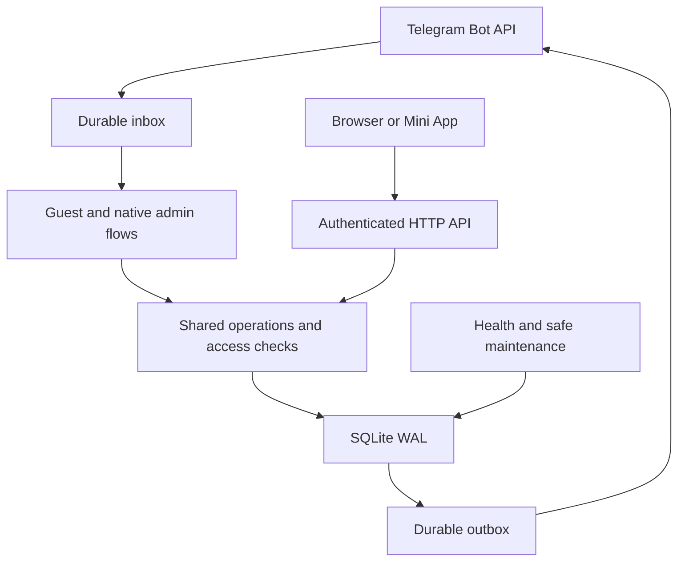

# FUTARCHIST: architecture and invariants

Version 2.1.1, schema 2. English is the only interface language. The runtime is a Python standard-library service on one persistent VPS. Native Telegram screens and the web dashboard invoke the same application operations. The existing fundraising website is a separate product. Its data is not automatically imported or synchronized.

## Surfaces

| Surface | Responsibility | Authentication |
| --- | --- | --- |
| Private Telegram bot | Guest forms, drafts, replies, native management and document delivery | Telegram numeric user ID plus workspace permission |
| Group bot | Explicit group binding and approved invitations | Verified group administrator, project representative or binding creator |
| Browser panel | Search, combined filters, detailed review, team setup, programs, tasks and exports | One-use login link or server-verified Telegram Mini App initData |
| Local simulator | Synthetic Telegram-shaped requests and buttons using the production application code | Explicit demo mode, loopback only, demo session |
| Server operations | Restart, database backup and recovery into a new path | VPS service account and filesystem permissions |

The recommended deployment runs `--mode bot` and `--mode web` in two OS processes. Web failure does not stop polling or native management. Telegram outage does not stop browser review. Database or whole-VPS failure remains a shared failure and requires backup or infrastructure recovery.

## Data and identity

Users have numeric Telegram IDs. Owner role is bootstrapped only from configured superadmin IDs. Guest activation does not create an admin. `add_admin` is owner-only. Existing superadmins cannot be demoted by another owner or silently removed by configuration.

A personal workspace belongs to one internal admin. A team workspace is a distinct internal collaboration container. Membership in a team never reveals a member's personal records. External project teams are project records, not internal workspace members.

The independent permissions are read_general, write_general, read_raise, write_raise, send, assign, export and routes. Write implies its necessary read access. Financial records, notes, events, tasks, filters and audit entries are redacted or rejected without read_raise. General access does not infer financial access. Superadmins have all permissions across active workspaces.

| Entity | Key relationship or invariant |
| --- | --- |
| Route | Workspace, creator, initial assignee, form purpose and secret code |
| Grant | One guest and one route, active state and activation date |
| Project | Workspace, submitter, general data, latest fundraising data and version |
| Case | General or raise branch, immutable source admin, immutable original route, current assignee |
| Thread | Project, branch, author, visibility, version and optional deletion timestamp |
| Event | Workspace, creator, kind, topic, time zone, status and outcome |
| Event project | Project participation in an event within the same workspace |
| Task | Workspace, creator, assignee, purpose, optional project/event and due date |
| Campaign | Frozen preview, recipients, creator and approval state |
| Activity | Actor, workspace, project, branch and action |
| Inbox/outbox | Durable update or delivery state, attempts, scheduling and deduplication |
| Operation token | Owner, exact operation payload, expiry and one-use flag |

## Entry gate

An admin receives a private code for their personal workspace and can create additional codes for a team workspace. `/activate CODE`, a plain code after Start, or the deep link activates that route for that guest. Codes may be limited by unique-user capacity, expiry or a specific numeric ID. Reusing the same activation does not consume capacity again.

Guest grants are rechecked at final submission and while resuming the form. Deactivating a route or guest grant closes that entry path. Code rotation creates a new route and disables the old one. Old case source tags remain unchanged. A new code does not silently reactivate old grants.

The legacy `public` route is rejected in real and demo gated mode even if its name is known. Expired codes cannot submit. Code creator and initial assignee must retain the required active workspace permissions. Reassigning a case does not change its source admin.

## Forms and workflows

General intake has seven fields, four required and three optional. Product stage and blockchain environment are separate. Raise questions are conditional on status and known currency. Failed or partial raises ask about retry. Target and amount raised are separate, preserve decimal text, and distinguish zero from missing data. Currency is mandatory before comparing monetary filters.

Draft state is durable. Every native and guest screen has a short random callback nonce. Stale buttons cannot act on a changed screen. Project, case, note, event and task edits use optimistic versions. Archive, restore, permanent purge, note deletion and workspace disabling require one-use owner confirmation tokens. Permanent project purge requires prior archive and refuses an in-flight related send.

Internal notes can be edited by their author or a superadmin with branch write permission. Guest replies and sent questions keep their original history. A correction is added as a new note. Project purge removes current database records, links and stored related delivery payloads. Previously sent Telegram messages and external backup copies are outside that transaction.

Program status, outcome and attendance support planning the next program from previous work. Tasks track responsibility, due date and completion. These records do not imply an invitation was sent. Invitations always have a separate preview and confirmation.

## Invitation and group rules

Templates accept only `{project}`, `{topic}`, `{when}` and `{sector}`. Attribute traversal, conversion and formatting directives are rejected. A campaign uses the selected workspace and project filters. Destinations are frozen during preview and rechecked for current access and consent at dispatch.

DM invitations require that the representative has started the bot and opted in. `/stop` disables invitations. Group invitations require a project-bound group and recorded consent. A binding token expires in ten minutes and is one-use. Anonymous group admins cannot be tied to an application account. Binding calls the real API to verify group administration. The bot does not ingest general group conversation.

The same chat is deduplicated inside one campaign. Groups and private destinations get their own delivery and response records. Public numeric IDs in forms never become signed-in users. The bot cannot initiate a private chat merely from an ID supplied by someone else.

## Fault handling

| Failure | Behavior | Recovery |
| --- | --- | --- |
| Telegram outage | Browser works, poller backs off, sends stay durable or become uncertain | Bounded connection retries, no payload duplication |
| Browser request error | Transaction rolls back, safe error and incident ID returned | Retry after checking current state or use `/manage` |
| Malformed update | That transaction rolls back, other updates continue | Up to five attempts, then owner-controlled retry |
| Temporary group verification failure | No group is bound, delayed update retry | Bounded retry and narrow recent-update autorepair |
| Export build error | That delivery fails, next job proceeds | Correct permission/filter/size, request a new export |
| Telegram 429 | Explicit API rejection schedules another attempt | Respect retry_after with bounded attempts |
| Timeout or Telegram 5xx while sending | Outcome becomes uncertain | Manual verification, never blind resend |
| Blocked bot or removed group | Delivery fails and destination is disabled | Recipient Start or explicit group rebind |
| Worker exception | Component incident recorded, independent workers continue | Backoff and worker supervision |
| Process crash | Pending data remains, in-flight sends become uncertain on restart | systemd restarts only the crashed process |
| SQLite corruption or no disk space | Health check fails, writes can stop | Operator restores a verified new database path |

Autorepair never invents a patch, silently rewrites business data, overwrites a database, or retries a send whose outcome is unknown. A network partition affecting both Telegram and the public panel cannot be made continuously available by the application itself.

## Exports

Projects, cases, raise, notes, events, tasks, campaign recipient results, activity, route metadata and groups have separate tables. `all` returns only permitted datasets. XLSX has multiple real OOXML worksheets. CSV is UTF-8 with BOM. Multiple CSV datasets arrive in a ZIP. Formula-like CSV values are escaped and XLSX values are literal inline strings. IDs and monetary values remain exact strings.

Project filters limit project-linked tables. Events or tasks without a project link and workspace-level route metadata do not acquire a fabricated project association. Activity export is not limited to the 500 rows displayed in the dashboard. Each table is capped at 100,000 rows and each generated file at 20 MB. Route export omits bearer codes. Native document jobs store a descriptor, then rebuild under current permissions before sending only to their requesting admin.

## Security, deployment and upgrade

Mini App initData is checked on the server with Telegram's HMAC procedure and a bounded timestamp. Sessions expire, are stored as hashes, and are invalidated on admin suspension or permission changes. Browser mutations require CSRF and origin checks. Mini App bearer tokens live in memory. No token or session key is logged. CSP, no-referrer, no-store, HTTPS secure cookies and loopback-only service binding are supplied.

WAL and foreign keys are enabled. SQLite backup uses its online backup API, including inside a request transaction via a separate read-only connection. Version 1 migration makes a pre-migration backup. Unknown schema versions fail closed. Version 2 owner configuration cannot silently discard an existing owner. `.env` and data are excluded from archives and each package has a file checksum manifest.

The package is a tested implementation, not an independent security audit or proof of unlimited scale. Moving to PostgreSQL for multiple hosts requires an explicit migration of locking, outbox claim semantics, backups and access tests.

## Primary documentation consulted

- Telegram Bot API: https://core.telegram.org/bots/api
- Bot conversation and rate limits: https://core.telegram.org/bots/faq
- Mini App initialization and validation: https://core.telegram.org/bots/webapps
- SQLite WAL: https://sqlite.org/wal.html
- SQLite online backup: https://sqlite.org/backup.html
- systemd service restart documentation, source: https://github.com/systemd/systemd/blob/main/man/systemd.service.xml

Product decisions and failure bounds above are the implementation's design choices. They are not guarantees made by Telegram, SQLite or systemd.
